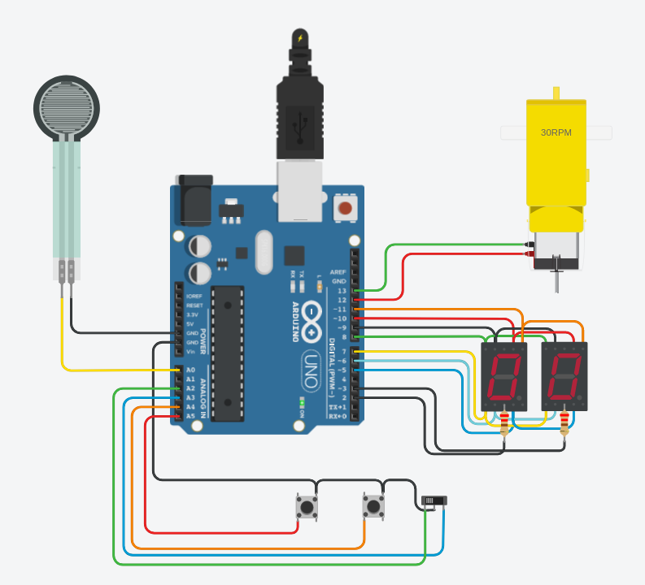

# Primer parcial domiciliario SPD

## Integrantes: 
- Patricio Pereyra
- Ailin Romano
- Fernanda Vasconnnet

## Proyecto: contador de 0 a 99

En este proyecto se diseñó un contador de 0 a 99 en una placa de arduino con dos display de 7 segmentos cátodo común multiplexados. El mismo contiene dos botones. El primero aumenta el contador, el segundo lo disminuye. 

Posee un switch deslizante que, si se encuentra a la izquierda, aumenta o disminuye la cuenta a través de los números primos; si se encuentra a la derecha, el contador se mueve de uno en uno a través de los números del 0 al 99. 

Agregamos un motor que gira hacia adelante o atrás dependiendo el modo en que se encuentre el contador y un sensor de fuerza que, solo en el caso de llegar a los 10 N, resetea el contador. 

## Funciones:

### setup():
Configura los pines como entrada o salida según corresponda.
Configura los pulsadores, el slide switch y el sensor de fuerza como entrada con resistencia de pull-up.

### loop():
Ejecuta el **bucle principal** del programa.
Llama a las funciones para **leer sensor de fuerza, manipular botones y encender displays**

### leeSensor(int sensor):
Lee el valor del sensor de fuerza y, si alcanza el valor máximo, resetea el contador.

### ManipularBotones():
Verifica el estado de los pulsadores y el slide switch.
Llama a la función Subir() y Bajar() para controlar el contador.
Llama a la función deslizante() para controlar el sentido del motor.

### deslizante(int izquierdo, int derecho):
Lee el estado del slide switch para determinar si el contador avanza en números primos o de uno en uno.
Controla la dirección del motor en consecuencia.

### Subir(int pulsador, int estadoAntBoton, bool modoPrimo):
Aumenta el valor de las unidades o decenas cuando el pulsador es presionado.
Controla si se mueve a través de números primos o de todos los números del 0 al 99.

### Bajar(int pulsador, int estadoAntBoton, bool modoPrimo):
Disminuye el valor de las unidades o decenas cuando el pulsador es presionado.
Controla si se mueve a través de números primos o de todos los números del 0 al 99.

### EsPrimo(int num):
Determina si un número pasado como parámetro es primo o no.
Devuelve true si el número es primo y false si no lo es.

### PrenderDisplay(int display, int numero):
Enciende un display específico (UNIDADES o DECENAS) y muestra un número en él.
Llama a la función MostrarNumero() para activar los segmentos correspondientes.

### MostrarNumero(int numero):

Enciende los segmentos del display según el número pasado como parámetro.
Apaga previamente todos los segmentos para evitar superposiciones.

### ApagarDisplay():

Apaga todos los segmentos del display para preparar el siguiente número a mostrar.

### Resetear():

Restablece el contador a 00 cuando se detecta la máxima fuerza en el sensor.

## Ver el proyecto
[En este link](https://www.tinkercad.com/things/0jIUsnorCgD) está el proyecto en la plataforma Tinkercad.

## Demo en video
Grabamos un video en donde mostramos como funciona nuestro proyecto, [podés verlo acá](https://drive.google.com/file/d/10BdWdoWMyWS7gipp0D5-6EOVKSMFKBiT/view?usp=share_link).

