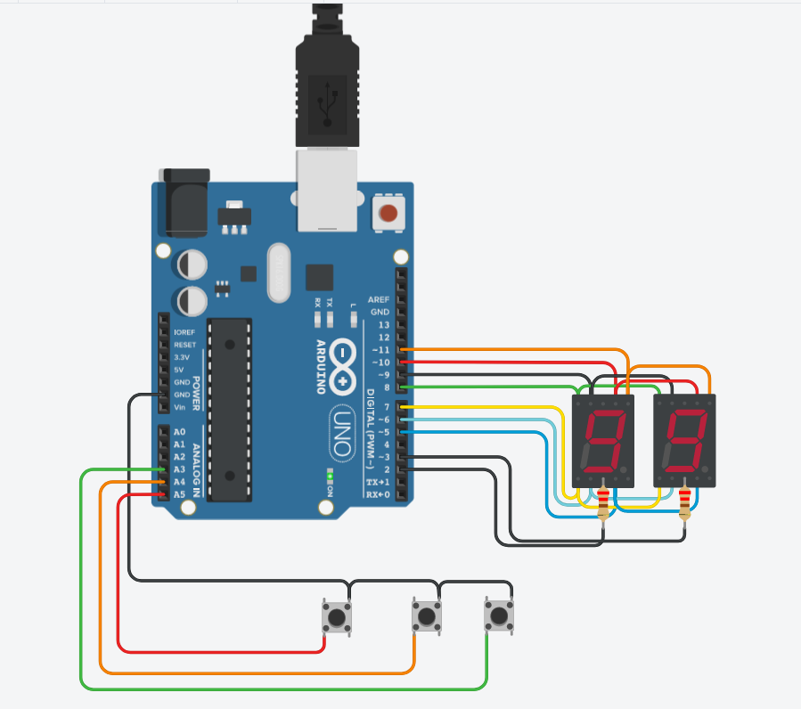

# Primer parcial domiciliario SPD

## Integrantes: 
- Patricio Pereyra
- Ailin Romano

## Proyecto: contador de 0 a 99

En este proyecto se diseñó un contador de 0 a 99 en una placa de arduino con dos display de 7 segmentos cátodo común multiplexados. El mismo contiene tres botones. El primero aumenta el contador en una unidad, el segundo disminuye la cuenta en una unidad y el tercero resetea el contador en cero. 

## Funciones:

### setup()

- Esta función se ejecuta una vez al inicio del programa. Configura los pines utilizados en el circuito, tanto para la salida de datos a los displays como para la entrada de los pulsadores. Los pulsadores se configuran con resistencias pull-up internas para su detección.

### loop()

- Función principal que se ejecuta en un bucle continuo después de la configuración inicial. Controla la lógica principal del programa, que incluye alternar entre la visualización de unidades y decenas en los displays y gestionar los pulsadores para aumentar, disminuir o restablecer los valores mostrados en los displays.

### ManipularBotones()

- Esta función verifica el estado de los pulsadores y actualiza las variables que rastrean su estado anterior. Se utiliza para detectar cuándo se presionan los pulsadores de subir, bajar y restablecer.

### Subir(int pulsador, int estadoAntBoton)

- Esta función se encarga de incrementar el valor de las unidades o decenas cuando se presiona el botón de subir. Si el valor de las unidades llega a 10, se reinicia a cero y se incrementa el valor de las decenas.

### Bajar(int pulsador, int estadoAntBoton)

- Esta función disminuye el valor de las unidades o decenas cuando se presiona el botón de bajar. Si el valor de las unidades llega a 0, se establece en 9 y se decrementa el valor de las decenas.

### Resetear(int pulsador, int estadoAntBoton)

- Cuando se presiona el botón de restablecer, esta función restablece los valores de unidades y decenas a cero.

### PrenderDisplay(int display, int numero)

- Esta función se utiliza para encender y apagar los displays según sea necesario. Controla la lógica de la multiplexación de los displays, asegurándose de que solo uno esté encendido en un momento dado.

### MostrarNumero(int numero)

- Esta función se utiliza para mostrar un número en los displays LED de 7 segmentos. Configura los pines correspondientes a los segmentos A, B, C, D, E, F y G para mostrar el número proporcionado como parámetro.

### ApagarDisplay()

- Esta función apaga todos los segmentos de los displays, asegurando que no se muestre ningún número en ellos.

Todas estas funciones trabajan juntas para crear un sistema que permita al usuario incrementar, disminuir y restablecer valores en los displays LED de 7 segmentos utilizando pulsadores.

## Ver el proyecto
[En este link](https://www.tinkercad.com/things/2lvHUsaZFAT?sharecode=v3u23u9ZqbUqLvU3CQkFhtTGDUxi--_OwQYGhyNlhBg) está el proyecto en la plataforma Tinkercad.

## Demo en video
Si querés ver la demo de nuestro proyecto, [podés hacerlo acá](https://www.loom.com/share/2a0bec58491e4c078003808fe90af378?sid=bac2e6a6-ef8d-4bc9-b516-eb9dc1063fea).

